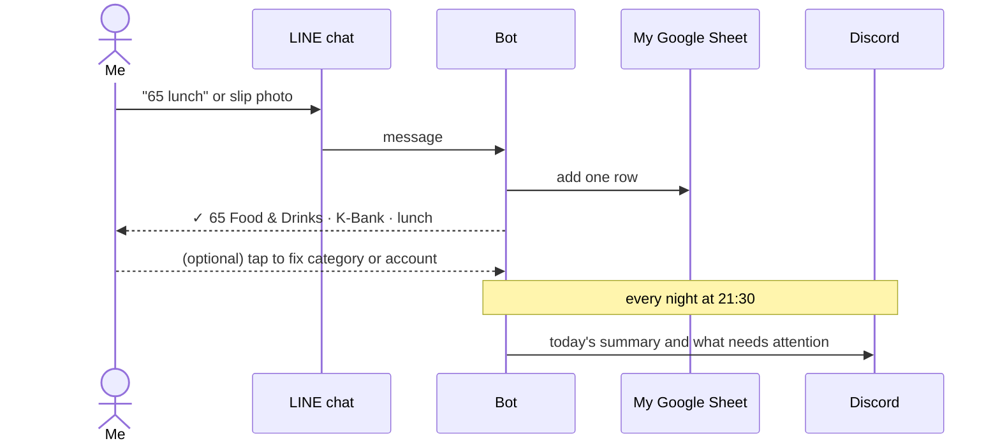
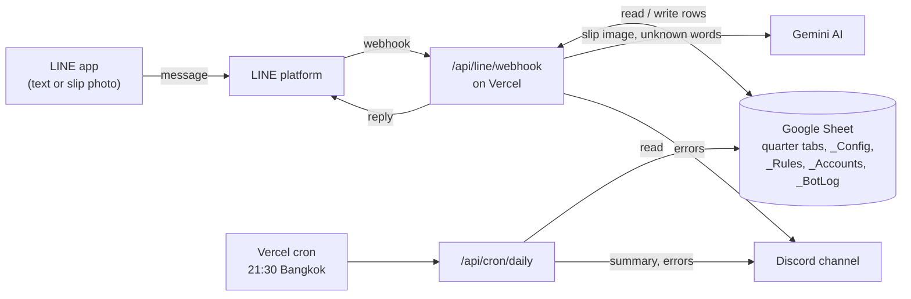

# money-tracker-bot

For people who track their money in a Google Sheet but keep putting off the logging: send a quick LINE message when you pay, and the row is written for you.

```
You:  65 lunch
Bot:  ✓ 65 Food & Drinks · K-Bank · lunch      [Account] [Category] [Delete]
```

<!-- Screenshot placeholder: LINE chat showing a text entry, a slip photo, and the bot's replies. Save as docs/images/line-chat.png -->

---

## The problem

My budget spreadsheet goes back to 2022. It now lives in Google Sheets, with one tab per quarter and one row per purchase.

The weak point was the moment of payment. I would tell myself "I'll log it when I get home." Sometimes I did. Often one day became two, then a week, and I forgot what I had bought.

When that happened, I had two choices:

- **Catch up from memory.** A full catch-up took 10 to 20 minutes of trying to remember each purchase.
- **Recalibrate.** I typed in the real balance of each account and added one correction row for the difference. This fixes the totals, but the money in that row has no category, so I no longer know what I spent it on.

My own sheet shows how often this happened:

| | July to September 2026 | October 1 to 5, 2026 |
|---|---|---|
| Days with at least one entry | 11 of 92 days (none in July or September) | 4 of 5 days, but 16 of 26 rows are dated October 5 |
| Expenses with no category | 15 of 53 | 10 of 14 |
| Size of the latest correction row | about ฿5,500, spread over 7 accounts | about ฿6,400, spread over 6 accounts |

I also tried budgeting apps. They raised a different worry: if the app shuts down or I switch to another one, my history may be lost or stuck in a format I can't move.

So the problem was not the spreadsheet. It was the few seconds of effort at the moment of paying, which I kept pushing to later.

---

## The solution

The goal: logging a purchase takes under 5 seconds, right when I pay, in an app I already have open.

What I do now:

1. **Pay for something.**
2. **Open LINE and message the bot.** Either type the amount and a word (`65 lunch`), or send the payment slip, which is the confirmation image a Thai banking app shows after a transfer.
3. **Get a reply with a ✓.** It shows the amount, category and account. A row is now in my sheet.
4. **Fix it with one tap if needed.** Buttons let me change the account or category, or delete the row. When I fix a category, the bot remembers that word for next time.
5. **If I spent nothing today, send `0`.** That way "no entries" and "forgot to log" are not the same thing.
6. **At 21:30 every night, read a short summary on Discord** (a chat app). It shows how many entries I made today, which categories are close to their monthly limit, and which rows still need a category. If I logged nothing and didn't send `0`, it says so.
7. **On Sundays, check balances.** The summary lists what the sheet thinks each account holds. If one is off, I send `bal k 3200` (my real balance), and the bot adds one small correction row. This replaces the big quarterly correction.



---

## Key decisions

**1. Where to log**
- Considered: a budgeting app, a form, or a new app of my own.
- Chose: a chat with a bot in LINE.
- Why: LINE is already open on my phone all day, so there is nothing new to open or install, and typing `65 lunch` is about as short as logging can get.
- Trade-off: on LINE's free plan, the bot can only reply to my messages. It can't start a conversation, so reminders and summaries go to Discord instead.

**2. Where the data lives**
- Considered: moving to a budgeting app's own storage.
- Chose: keep my existing Google Sheet as the only place data is stored.
- Why: it has my history back to 2022, I can read and edit it myself, and it does not depend on any app staying in business.
- Trade-off: the bot has to fit my sheet, not the other way around. It places each row inside the right month section and does not change my existing formulas. It also only adds a category ("Untracked") in a spot where my formulas already count every account.

**3. A wrong number vs a missing row**
- Considered: always writing what the bot reads from a slip photo.
- Chose: if the bot is not sure about the amount, it asks "Is 1,250 right?" and writes nothing until I tap Yes.
- Why: a wrong amount quietly breaks my totals. A missing row is easy to notice and fix.
- Trade-off: sometimes one extra tap.

**4. How categories are picked**
- Considered: asking me every time, or letting AI decide every time.
- Chose: first the words I have taught it, then a direct match with a category name (`coffee` is Coffee & Tea), then Google's Gemini AI, limited to my own category list. If none of these is confident, the bot saves the row without a category and asks with buttons.
- Why: most purchases repeat (same café, same commute), so after a while the bot rarely needs the AI. That also keeps it inside the AI's free usage limit.
- Trade-off: unknown words and slip photos are sent to Google to be read.

**5. Sharing it with others**
- Considered: one shared bot that many people could add as a friend.
- Chose: everyone runs their own copy, connected to their own sheet. Account names and shortcuts are set in a tab inside the sheet, so no code changes are needed.
- Why: no shared database to run or secure, everyone's money data stays in their own Google Drive, and it stays free.
- Trade-off: each person has to set up five free services themselves (see the setup guide below).

**Constraint behind all of these: it has to cost nothing to run.** It uses only free plans: Vercel (hosting), LINE, Gemini, and Discord.

---

## What is still unproven

The bot works when I test it from my own LINE account on my computer, and its automated tests pass. These parts have not been checked in real use yet:

- **Daily use.** It is not deployed yet, so I don't know if it changes my habit.
- **The 5-second goal.** I have not timed an entry from opening LINE to the ✓ reply.
- **Slip photos.** Reading has only been tested with made-up answers, not real slips from my banks.
- **Category guesses.** I have not measured how often the AI picks the right category.
- **The blank template for new users.** It has not been opened in real Google Sheets yet.
- **Other people.** Nobody else has set it up yet.

**What I'll do next:** deploy it and use it every day for a month. Then I'll compare that month with the table above: days with an entry, expenses without a category, and the size of balance corrections.

---

## Technical overview

The bot is a small web app on Vercel (a free hosting service). When I message the bot, LINE forwards the message to the app. The app checks it really came from LINE and from me, reads the sheet's layout, and writes one row through the Google Sheets API (the official way for programs to edit a Google Sheet). Gemini reads slip photos and guesses categories for new words. Once a night, Vercel runs a scheduled job that reads the sheet and posts a summary to Discord. All settings and memory live in the sheet itself: the `_Config` tab holds account names and shortcuts, `_Rules` holds learned words, `_Accounts` holds my own account numbers (so a payment to one of them counts as a transfer between my accounts), and `_BotLog` is the bot's activity log.



---

# Setup guide

## Contents
1. [What you need](#1-what-you-need)
2. [Set up your sheet](#2-set-up-your-sheet)
3. [Google service account](#3-google-service-account)
4. [LINE bot](#4-line-bot)
5. [Gemini and Discord](#5-gemini-and-discord)
6. [Deploy to Vercel](#6-deploy-to-vercel)
7. [Connect LINE and test](#7-connect-line-and-test)
8. [Using the bot](#using-the-bot)
9. [Customize](#customize)
10. [Troubleshooting](#troubleshooting)
11. [Development](#development)

Setup takes about 30 to 45 minutes. Keep a text file open and paste each value into it as you go:

```
LINE_CHANNEL_SECRET=
LINE_CHANNEL_ACCESS_TOKEN=
LINE_USER_ID=
GOOGLE_SERVICE_ACCOUNT_JSON=
SHEET_ID=
GEMINI_API_KEY=
DISCORD_WEBHOOK_URL=
CRON_SECRET=
```

---

### 1. What you need

All free:
- A Google account (Sheets, Cloud Console, AI Studio)
- A LINE account, plus a [LINE Developers](https://developers.line.biz/console/) login
- A [GitHub](https://github.com) account and a [Vercel](https://vercel.com) account (sign in with GitHub)
- A Discord server where you can create a webhook

Then **fork this repo** on GitHub (Fork button, top right).

---

### 2. Set up your sheet

1. Download [`template/Budget_Template.xlsx`](template/Budget_Template.xlsx).
2. Upload it to Google Drive, open it, then **File > Save as Google Sheets**. Use the Google Sheets version from now on (the bot can't edit `.xlsx` files).
3. Edit it to match your life:
   - **`_Template` row 18, columns E to N**: your account names (bank, cash, wallets). Up to 10. Leave unused columns blank.
   - **`_Config`**: one row per account. The **Account** must match the row 18 header exactly. **Code** is what you type (`65 lunch c`). Put `x` in **Default** for the account used when you type no code.
   - **`_Template` E2:E11 (Start)**: your current balance for each account.
   - **`_Template` P2:P51**: your categories. Keep `Untracked`.
   - **`Budget` B6:C25**: categories and monthly targets (optional, used by the digest).
4. Copy the **Sheet ID** from the URL:
   ```
   https://docs.google.com/spreadsheets/d/1AbC...xyz/edit
                                          ^^^^^^^^^^ SHEET_ID
   ```

You don't need to create quarter tabs. The bot makes `2026 Q4` (and so on) from `_Template` on the first entry of each quarter, and carries balances over.

> Already have a budget sheet? See [Using your own sheet](#using-your-own-sheet).

---

### 3. Google service account

The bot logs in to Sheets as a "service account" (a robot Google user).

1. Open [Google Cloud Console](https://console.cloud.google.com/) and create a project (any name).
2. **APIs & Services > Library** > search **Google Sheets API** > **Enable**.
3. **IAM & Admin > Service Accounts > Create service account**. Any name, skip the optional steps.
4. Open it > **Keys > Add key > Create new key > JSON**. A file downloads.
5. Open that file and copy `client_email` (looks like `money-bot@my-project.iam.gserviceaccount.com`).
6. In your sheet: **Share** > paste that email > **Editor** > untick "Notify people" > Share.
7. Turn the JSON file into one line for `GOOGLE_SERVICE_ACCOUNT_JSON`:
   ```bash
   base64 -w0 key.json        # Linux
   base64 -i key.json         # macOS
   ```
   (Pasting the raw one-line JSON also works.)

Keep the key file private. Anyone with it can edit your sheet.

---

### 4. LINE bot

1. [LINE Developers Console](https://developers.line.biz/console/) > **Create a provider** (your name) > **Create a Messaging API channel**. This also creates a LINE Official Account.
2. **Basic settings** tab:
   - **Channel secret** → `LINE_CHANNEL_SECRET`
   - **Your user ID** (starts with `U`, at the bottom) → `LINE_USER_ID`. This is *your* ID, not the bot's. The bot ignores everyone else.
3. **Messaging API** tab:
   - Bottom: **Channel access token (long-lived)** > **Issue** → `LINE_CHANNEL_ACCESS_TOKEN`
   - Scan the QR code with your phone to add the bot as a friend.
4. Click **LINE Official Account features > Edit** (opens Official Account Manager) > **Response settings**:
   - Auto-reply messages: **Off**
   - Greeting message: **Off**
   - Webhooks: **On**

The Channel ID (a 10-digit number) is not needed.

---

### 5. Gemini and Discord

**Gemini** (reads slips, guesses categories for new words):
[Google AI Studio](https://aistudio.google.com/apikey) > **Create API key** → `GEMINI_API_KEY`.
Default model is `gemini-3.5-flash`. Free-tier limits change, so check AI Studio > Rate limits. If you hit the limit, set `GEMINI_MODEL` to a Flash-Lite model.

**Discord** (nightly digest and error alerts):
Server Settings > **Integrations > Webhooks > New Webhook** > pick a channel > **Copy Webhook URL** → `DISCORD_WEBHOOK_URL`.

**Cron secret**: any long random string → `CRON_SECRET`
```bash
openssl rand -hex 32
```

---

### 6. Deploy to Vercel

1. [Vercel](https://vercel.com/new) > **Import** your fork.
2. Before deploying, open **Environment Variables** and add all 8 values from your text file.
3. **Deploy**. Note your URL, e.g. `https://money-bot-yourname.vercel.app`.

The nightly digest is already scheduled in `vercel.json` for 21:30 Bangkok time (14:30 UTC). On the Hobby plan it may run any time within that hour. To change it, edit the cron expression (UTC).

---

### 7. Connect LINE and test

1. LINE Developers > your channel > **Messaging API** tab > **Webhook URL**:
   `https://<your-app>.vercel.app/api/line/webhook`
2. Click **Verify** (should say Success), then turn on **Use webhook**.
3. Optional: turn on **Webhook redelivery**. It's safe, and duplicates are ignored.

Now in LINE, send these to your bot:

| Send | Expect |
|---|---|
| `help` | The command list. Also creates hidden tabs `_Rules`, `_Accounts`, `_BotLog` |
| `65 coffee` | `✓ 65 Coffee & Tea · <default account> · coffee` and a row in the sheet |
| `undo` | `Undone: ...` and the row is cleared |

Then trigger the digest once to check Discord:
```bash
curl -H "Authorization: Bearer <CRON_SECRET>" https://<your-app>.vercel.app/api/cron/daily
```

Done. 🎉

---

### Using the bot

| Send | Result |
|---|---|
| `65 lunch` | Expense from your default account |
| `65 lunch c` | Expense from the account with code `c` (last word, exact code only) |
| `+7000 salary` | Income |
| `+134 food` | Refund: positive amount in that category (only if the word is a known category or rule) |
| `t b c 500` | Transfer: account `b` to account `c` |
| `bal b 3200` | "My real balance is 3200." Logs the difference as `Untracked` |
| `undo` | Removes the last row the bot wrote |
| `0` | "I spent nothing today" |
| `help` | Command list with your account codes |
| 📷 slip photo | Reads amount, bank, recipient, date, reference |

**Buttons** under each confirmation:
- **Account**: move the amount to another account
- **Category**: change the category. The bot remembers `description → category` for next time
- **Delete**: clear the row

**Categories** are picked in this order:
1. Your learned rules (`_Rules`)
2. A category name match (`coffee` → Coffee & Tea)
3. Gemini, limited to your category list

If none of these is confident, the row is saved without a category and the bot asks with buttons.

**Slips**:
- Sending the same slip twice is ignored.
- If the amount is unclear, the bot asks "Is 1,250 right?" before writing anything.
- A slip paid *to* one of your own accounts (listed in `_Accounts`) is logged as a transfer.

**Nightly digest** (Discord, 21:30):
- Daily: today's entries and total. If you logged nothing and didn't send `0`, it says so.
- Daily: categories near or over their monthly target.
- Daily: rows that need review.
- Sundays: every account balance, so you can send `bal` for any that are off.
- Last day of the month: days logged, Untracked total, rows without a category.

---

### Customize

All settings live in the sheet. No redeploy needed.

**`_Config`**: accounts

| Column | Meaning |
|---|---|
| Code | What you type. Letters/digits, unique. Not `bal`, `undo`, `help` |
| Account | Exactly the row 18 header in quarter tabs |
| Default (x) | Account used when you type no code. One row only |
| bal category | Category for `bal` gap rows. Blank = `Untracked` (e.g. a transit card might use `Transportation`) |
| Also called | Other header spellings in older tabs, comma separated |
| Slip names | Words printed on slips from this bank/app, e.g. `k plus, kbank` |

To add an account: type the name in an empty `_Template` row 18 column (E to N) **and** in the current quarter tab, then add a `_Config` row.

**`_Accounts`** (hidden): your own account numbers or wallet names, so payments to them count as transfers.

| Match | Account |
|---|---|
| `1234` | `sv` (the digits visible on slips, e.g. `xxx-x-x1234-x`; at least 4) |
| `TrueMoney top up` | `e` (recipient name as printed) |

**`_Rules`** (hidden): `keyword → category`. Filled automatically by the Category button. Edit freely.

**Categories**: `_Template` P2:P51 (and the current quarter tab's P column).

To unhide a tab: **View > Hidden sheets**.

#### Using your own sheet

The bot works with any sheet that follows the template's layout:

- A `_Template` tab, and quarter tabs named `YYYY QN` (e.g. `2026 Q4`)
- **Row 18**: `Date | Type | Category | Description | <account columns from E>`. Column **O** is reserved for the bot's row ID, so you can have at most 10 accounts (E to N)
- **Rows 20+**: transactions. Type is `Income`, `Expense`, `Transfer` or `Recalibrate`. Amounts are negative for money out
- **Month header rows** in column A (e.g. `October`) split each quarter. New rows go into the right month block
- **C2:D14**: current balance (C) per account name (D)
- **P2:P51**: categories, with a spending formula in Q
- **R1 / R2**: year and quarter
- **Budget!B6:C25** (optional): category and monthly target

If `_Config` doesn't exist, the bot creates it on the first message from your `_Template` row 18 headers.

---

### Troubleshooting

| Symptom | Fix |
|---|---|
| Webhook returns 200 in ~10ms, nothing happens | Your `LINE_USER_ID` is wrong. Check the logs (Vercel > Logs) for `ignored message from userId=...` and use that value |
| No reply at all, LINE shows nothing | Webhook URL wrong or **Use webhook** off. Click **Verify** in LINE Developers |
| Auto-reply message instead of the bot | Turn off auto-reply in LINE Official Account Manager > Response settings |
| "Error, nothing was logged" | Details are in Discord. Common causes are below |
| `The caller does not have permission` | Share the sheet with the service account email as **Editor** |
| `Google Sheets API has not been used in project` | Enable the Sheets API in Cloud Console (step 3.2) |
| `This operation is not supported for this document` | It's still an `.xlsx`. Use **File > Save as Google Sheets** |
| `has no "X" column (check _Config)` | A `_Config` account name doesn't match the row 18 header |
| `_Config: ...` | Fix the listed problem in `_Config` (duplicate code, two defaults, ...) |
| Gemini `429` | Free quota used up. Rules still work. Wait, or set `GEMINI_MODEL` |
| Changed env vars, no effect | Redeploy on Vercel (or restart `npm run dev` locally) |

---

### Development

```bash
npm install
cp .env.example .env.local     # fill in
npm test                       # unit + end-to-end tests, all services mocked
npm run typecheck
npm run dev                    # http://localhost:3000
```

**Talk to your local bot from LINE**: LINE needs HTTPS, so use a tunnel and set its URL as the webhook URL:
```bash
npx cloudflared tunnel --url http://localhost:3000
```

**Without LINE** (send a signed fake message; the reply fails because the token is fake, but the row is written):
```bash
source .env.local
B='{"events":[{"type":"message","replyToken":"x","source":{"userId":"'$LINE_USER_ID'"},"message":{"id":"test1","type":"text","text":"65 coffee"}}]}'
SIG=$(printf '%s' "$B" | openssl dgst -sha256 -hmac "$LINE_CHANNEL_SECRET" -binary | base64)
curl -X POST localhost:3000/api/line/webhook -H "x-line-signature: $SIG" -d "$B"
```

**Rebuild the template** after editing `template/template.config.json`:
```bash
npm run template
```

#### Project layout

| Path | What |
|---|---|
| `app/api/line/webhook` | LINE webhook: signature check, owner only, reply-only (no push messages, which the free plan caps) |
| `app/api/cron/daily` | Nightly digest, protected by `CRON_SECRET` |
| `lib/parser.ts` | Text commands |
| `lib/workbook.ts` | Sheet layout: columns, month blocks, row placement, new quarters |
| `lib/bot.ts` | Commands, buttons, slips |
| `lib/digest.ts` | Discord digest |
| `lib/accounts.ts`, `lib/state.ts` | `_Config`, `_Rules`, `_Accounts`, `_BotLog` |
| `test/` | Tests with an in-memory Google Sheets fake |

#### How rows are written
- The tab is chosen by the entry date (`YYYY QN`). Columns are found by reading row 18.
- A new row goes in its month's block, after the last dated row. Rows without a date are never overwritten. If a block is full, a row is inserted before the next month header.
- Dates are written as real dates. Typed text that looks like a formula stays plain text.
- Column O holds a unique ID (`L<LINE message id>` or `S<slip reference>`), so retries and repeated slips never duplicate.
- `undo` and Delete clear the row's values instead of deleting the row, so formulas and month blocks never shift.
- New quarter: copies `_Template`, sets R1/R2, copies last quarter's balances into the Start column.

#### Privacy
The bot only answers the LINE user in `LINE_USER_ID`. The bot itself stores nothing outside your sheet. Slip images and unknown descriptions are sent to Google's Gemini API; on the free tier Google may use that data to improve its products (see the Gemini API terms). Never commit `.env.local` or the service account key.
